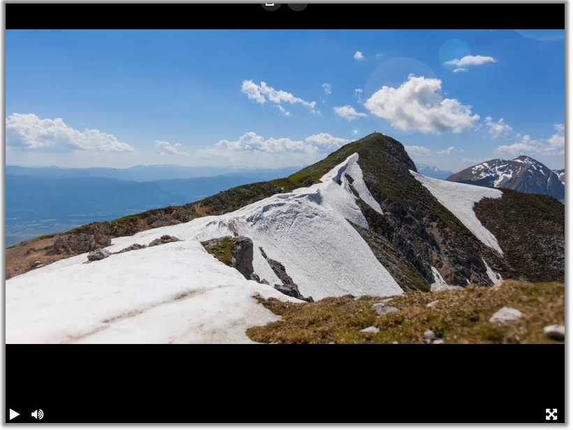

<!-- Плеер будет создан с задержкой, после того как загрузятся все ресурсы на странице. Для этого используется событие `DOMContentLoaded`. Благодаря этой особенности можно вызывать функцию `createPlayer` раньше, чем загрузятся все необходимые библиотеки: jQuery и Playable.
 -->

# Видеоплеер

Видеоплеер с функциями включения/выключения видео и звука на кнопку, показа видео со звуком, полноэкранного режима

Адрес сайта: https://golovolom288.github.io/videoplayer/

Построен на базе библиотеки [Playable](https://wix.github.io/playable/).
